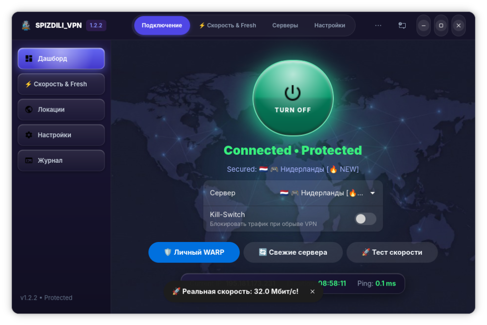

<p align="center">
  
</p>

<h1 align="center">🦝 SPIZDILI_VPN (v1.2.4)</h1>

<p align="center">
  <b>Современный, автономный и быстрый VPN-клиент нового поколения для Windows и Linux</b><br>
  <i>Прямое подключение без подписок и логинов • Studio Dashboard • VLESS Reality (XTLS Vision) • Личный Cloudflare WARP • WireGuard & AmneziaWG • Ускорение YouTube 4K • Оптимизация для AI IDE</i>
</p>

<p align="center">
  
</p>

<p align="center">
  
  
  
  
  
  
  
</p>

---

## 🪟 Запуск на Windows 7 / 8 / 10 / 11 (Без установки)

Версия для Windows собрана в виде **автономного `.exe` файла**, работающего «из коробки» на любой версии Windows:

1. Перейдите во вкладку **[Releases](https://github.com/newiziwavez33-hub/spizdili_vpn/releases/latest)**.
2. Скачайте **`SPIZDILI_VPN.exe`** (или `SPIZDILI_VPN_v1.2.4_Windows_x64.zip`).
3. Запустите `SPIZDILI_VPN.exe` — всё готово к работе сразу со всеми серверами, автоподключением к скоростным узлам и AI-оптимизацией!

---

## 🐧 Установка на Linux (Ubuntu / Debian / Astra / Mint / Fedora / Arch)

### Способ 1: Установка готового DEB пакета (Рекомендуется)
Скачайте **`spizdili-vpn_1.2.4_amd64.deb`** из [последнего релиза](https://github.com/newiziwavez33-hub/spizdili_vpn/releases/latest) и установите:
```bash
sudo dpkg -i spizdili-vpn_1.2.4_amd64.deb
```

### Способ 2: Установка из исходного кода
```bash
git clone https://github.com/newiziwavez33-hub/spizdili_vpn.git
cd spizdili_vpn
sudo ./install.sh
```

---

## 🌐 Расширение для Google Chrome (Chrome Extension)

В репозиторий добавлено официальное расширение для браузеров **Google Chrome**, **Chromium**, **Yandex Browser**, **Brave** и **Edge**:

### 📥 Установка плагина в Chrome:
1. Скачайте архив **`spizdili_vpn_chrome_extension.zip`** из [Releases](https://github.com/newiziwavez33-hub/spizdili_vpn/releases/latest) и распакуйте в любую папку.
2. В браузере перейдите по адресу `chrome://extensions/` и включите переключатель **«Режим разработчика»** (Developer mode) в правом верхнем углу.
3. Нажмите **«Загрузить распакованное расширение»** (Load unpacked) и укажите распакованную папку `chrome_extension`.
4. Закрепите значок **SPIZDILI_VPN** с енотом на панели расширений!

---

## 🌟 Ключевые возможности версии v1.2.4

### 🛡️ 1. Улучшенная регистрация и активация Cloudflare WARP
- **Умная регистрация аккаунта в РФ:** Регистрация персонального ключа WARP теперь автоматически использует многоуровневый маршрут — через активный локальный VPN-туннель (SOCKS5/HTTP `127.0.0.1:10808`), системный прокси и резервные прямые каналы. Это решает проблему блокировок `api.cloudflareclient.com` в России.
- **Мгновенная активация и наглядная индикация:** При включении Cloudflare WARP на главном дашборде крупно и чётко выводится статус **«🛡️ Cloudflare WARP • АКТИВЕН»** с подробным описанием работы безлимитного гигабитного канала.
- **Нативный WireGuard в пространстве пользователя (User-Space):** WireGuard запускается внутри `xray-core` без необходимости root-прав или sudo.
- **Резервный Cloudflare CDN Fast-Edge:** Автоматический откат на VLESS over TLS Anycast при блокировке UDP провайдером.

### 🎨 2. Новый дизайн Studio Dashboard
- **Тёмная стеклянная тема Glassmorphism:** фоновая карта созвездий, полупрозрачные карточки и неоновые акценты.
- **Интерактивная кнопка питания (Power Button):** большая круглая кнопка со статусом и световым градиентом (жёлтый — подключение, зелёный — активно, синий — ожидание).
- **Плавающий док телеметрии:** отображение текущего внешнего IP, длительности сессии, пинга в реальном времени и скорости канала.

### 🚀 3. Аппаратный круговой спидометр (Cairo Speedometer)
- Круговой неоновый тахометр с диапазоном измерений от **0 до 200 Мбит/с** и плавным движением стрелки (60 FPS интерполяция).
- Прямой замер фактической пропускной способности через CDN Cloudflare.
- Карточки быстрой аналитики: пинг (мс), размер тестового пакета (MB), время отклика (сек).

### ⚡ 4. Аудит и исключение нерабочих серверов
- Встроенная кнопка **«⚡ Проверить серверы (Исключить мёртвые)»**:
  - Параллельное TCP-тестирование всех серверов в базе (до 25 потоков с таймаутом 1.5с).
  - **Мгновенное удаление недоступных и заблокированных узлов** из списков выбора и базы данных приложения.

### 🎬 5. Ускорение YouTube и Google Video (4K без буферизации)
- **Блокировка QUIC (UDP:443):** устраняет зависания при воспроизведении видео, принудительно и мгновенно переключая браузер на TCP HTTP/2 через скоростной зашифрованный туннель.
- **Приоритетная маршрутизация:** прямое направление доменов `*.googlevideo.com`, `*.youtube.com`, `*.ytimg.com` через DoH DNS.
- **Расширенный буфер:** размер сокета увеличен до 256 КБ для стабильного стриминга видео в 1080p60 и 4K.

### 🤖 6. Оптимизация для AI IDE и разработчиков
- Полная стабильность для **Google Antigravity**, **Gemini**, **ChatGPT**, **Claude**, **GitHub Copilot**, **Cursor**, **OpenCode**.
- Защита потоковых сессий (gRPC / SSE) от обрывов, тайм-аут `connIdle: 900s`, TCP Keep-Alive (`15s`), `tcpNoDelay: true`.
- Приоритетный DoH DNS с принудительным `UseIPv4` для быстрого доступа к AI API.

---

## 🗂️ Список встроенных серверов (51 локация)

| № | Флаг и Страна | Протокол | Маскировка / Хост | Назначение |
|---|---|---|---|---|
| 1 | 🇸🇪 Швеция (Облако #1) | VLESS Reality | `sw.api-yandex.net` (282ms) | Сверхбыстрый, P2P, AI |
| 2 | 🇩🇪 Германия (Облако #2) | VLESS Reality | `www.cloudflare.com` (343ms) | Веб-серфинг, Streaming |
| 3 | 🇳🇱 Нидерланды (Облако #3) | VLESS Reality | `ads.x5.ru` (358ms) | Стабильный, AI IDE |
| 4 | 🇩🇪 Германия (Облако #4) | VLESS Reality | `www.cloudflare.com` (382ms) | Резервный маршрут |
| 5 | 🇳🇱 Нидерланды (Облако #5) | VLESS Reality | `www.samsung.com` (441ms) | Низкий пинг, Media |
| 6 | 🇺🇸 США (Облако #6) | VLESS Reality | `www.intel.com` (861ms) | Доступ к сервисам США |
| 7 | 🇺🇸 США (Облако #7) | VLESS Reality | `www.amd.com` (874ms) | Разработка, AI APIs |
| 8 | 🇺🇸 США (Облако #8) | VLESS Reality | `www.sony.com` (1012ms) | CDN США |
| 9 | 🇺🇸 США (Облако #9) | VLESS Reality | `www.tesla.com` (1041ms) | Защита от блокировок |
| 10 | 🇸🇬 Сингапур (Облако #10) | VLESS Reality | `www.nvidia.com` (1462ms) | Азиатский шлюз |
| 11 | 🇸🇬 Сингапур (Облако #11) | VLESS Reality | `www.nvidia.com` (1476ms) | Резервный азиатский |
| 12 | 🇸🇬 Сингапур (Облако #12) | VLESS Reality | `www.intel.com` (1485ms) | Сверхнадежный |
| 13 | 🇸🇬 Сингапур (Облако #13) | VLESS Reality | `www.amd.com` (2042ms) | Дальний восток |
| 14 | 🇰🇷 Корея (Облако #14) | VLESS Reality | `www.apple.com` (2052ms) | Прямой азиатский |
| 15–51 | 🇪🇺 Европа (37 серверов) | VLESS / AWG / WG | Финляндия, Германия, Нидерланды и др. | Базовый европейский пул |

---

## 🛠️ Сборка из исходников

### Сборка `.deb` пакета для Linux:
```bash
dpkg-deb --root-owner-group -b package_dir spizdili-vpn_1.2.4_amd64.deb
```

### Сборка standalone `.exe` для Windows (PyInstaller):
```bash
python windows/build_exe.py
# Создает dist/SPIZDILI_VPN.exe и dist/SPIZDILI_VPN_v1.2.4_Windows_x64.zip
```
